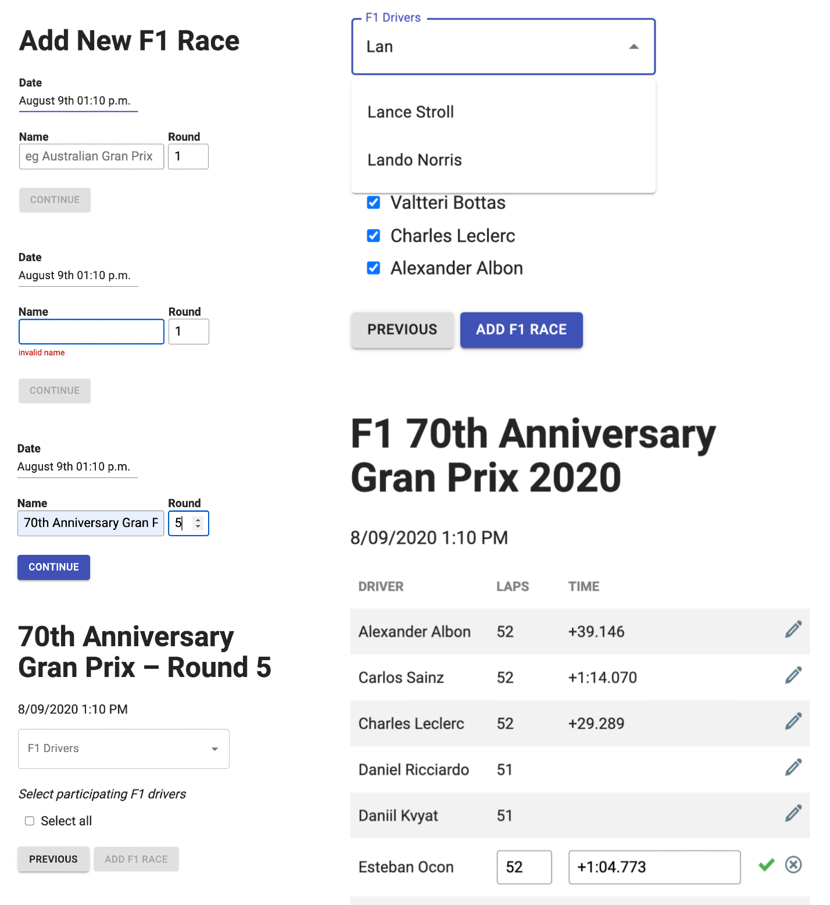

# Formula1-Admin

Read/write admin application

- add new Formula1 races with participating drivers
- update results per F1 driver

With React, Material-UI, Apollo Client, Apollo Server, Node-Postgres, PostgreSQL

## PostgreSQL

#### Installation

Download and install [PostgreSQL](https://www.postgresql.org/download/)

Note credentials and name you choose for it during installation

For example, you named it 'local-db' at installation

#### Store database credentials

Create a .env file at the root directory of the server folder to store your database credentials

Open up pgAdmin, that came with the Postgres installation

Double-click 'local-db' and create a database under it named 'dev'

The example .env file would be:

```bash
HOST=localhost
PORT=5432
DB_NAME=dev
USERNAME=postgres
PASSWORD=yourpassword
```

#### Create schemas

Open pgAdmin to create two schemas

Run server/resolvers/sql/schema_formula1.sql

Run server/resolvers/sql/schema_f1admin.sql

Import data for formula1 schema for read-only

Write to tables in f1admin schema

#### Import data

In pgAdmin, open 'local-db', then 'dev', 'Schemas', 'formula1', 'Tables'

Import CSV data from server/resolvers/csv folder with [postgresqltutorial](https://www.postgresqltutorial.com/import-csv-file-into-posgresql-table/)

[Formula1 data is from Ergast Developer API](http://ergast.com/mrd/)

## Server API and Client

#### Install and start

Server API

```bash
cd server
npm install
npx nodemon ./graphql.js
```

Client application

```bash
npm install
npm start
```

## User interface



## Contributing

Pull requests are welcome. For major changes, please open an issue first to discuss what you would like to change.

## License

[MIT](https://choosealicense.com/licenses/mit/)
